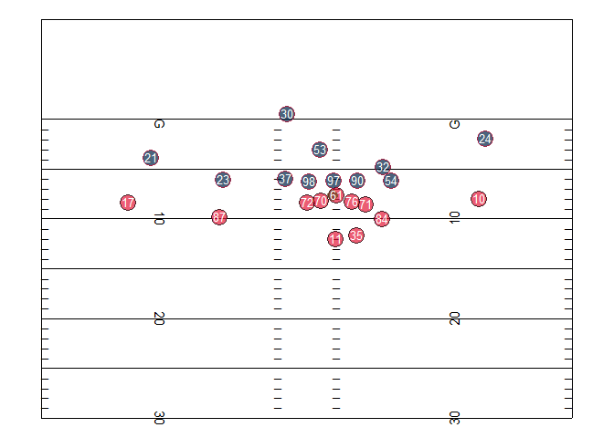

<!-- README.md is generated from README.Rmd. Please edit that file -->


Welcome to the data homepage for the NFL's Big Data Bowl.

**Our inaugural contest is now closed (as of January 25, 2019).**

For those interested in trying NFL tracking data via [Next Gen Stats](https://nextgenstats.nfl.com/), we still show a style guide with references to each data set and each variable, a list of FAQs related to player tracking data and this contest, and a tutorial on how to visualize and animate the player tracking data using the [R Statistical Software](https://cran.r-project.org/), and one game of tracking information.

What remains in this repository
-------------------------------

1.  Player tracking data one 2017 game. See <https://github.com/nfl-football-ops/Big-Data-Bowl/tree/master/Data>. Tracking data is stored as a unique .csv file: `tracking_gameId_[gameId].csv`, where `[gameId]` is a unique, 10-digit identifier for each game.

2.  Player, play, and game-level data that correspond to the tracking data. See <https://github.com/nfl-football-ops/Big-Data-Bowl/tree/master/Data> for each of these .csv files.

3.  A Data schema, which contains information on each of the variables in the data set, as well as the *key* variables needed to link the data sets together. See <https://github.com/nfl-football-ops/Big-Data-Bowl/blob/master/schema.md>.

4.  A list of Data FAQs. See <https://github.com/nfl-football-ops/Big-Data-Bowl/blob/master/faqs.md>.

Call for papers
---------------

Folks who have developed methods for analyzing player tracking data are encouraged to submit papers to the Journal of Quantitative Analysis in Sports, which is running a special issue. For more information, see the Call for Papers ([link](https://twitter.com/StatsbyLopez/status/1086742246161043457)).

Official rules
--------------

A complete set of official rules for the Big Data Bowl can be found [here](http://ops.nfl.com/big-data-bowl).

What player tracking data looks like
------------------------------------

A brief tutorial using the `gganimate` [package](https://github.com/thomasp85/gganimate) in R to animate the tracking data follows.

### Reading in the data

First, the following code reads in a few of the different data sets and selects a play to animate (Demetrius Harris's TD reception during Week 1, video [here](https://twitter.com/Chiefs/status/905963498169032704).

``` r
library(tidyverse)
file.tracking <- "https://raw.githubusercontent.com/nfl-football-ops/Big-Data-Bowl/master/Data/tracking_gameId_2017090700.csv"
tracking.example <- read_csv(file.tracking)

file.game <- "https://raw.githubusercontent.com/nfl-football-ops/Big-Data-Bowl/master/Data/games.csv"
games.sum <- read_csv(file.game) 

file.plays <- "https://raw.githubusercontent.com/nfl-football-ops/Big-Data-Bowl/master/Data/plays.csv"
plays.sum <- read_csv(file.plays) 

tracking.example.merged <- tracking.example %>% inner_join(games.sum) %>% inner_join(plays.sum) 

example.play <- tracking.example.merged %>% filter(playId == 938)

example.play %>% select(playDescription) %>% slice(1)
#> # A tibble: 1 x 1
#>   playDescription                                                          
#>   <chr>                                                                    
#> 1 (3:10) (Shotgun) A.Smith pass short right to D.Harris for 7 yards, TOUCH~
```

### Animating the data

The following code animates each player that was on the field. As one note, the code is flexible, such that plays at different parts of the field could feature different boundaries. As a second, the x-axis and y-axis coordinates are flipped.

``` r
library(gganimate)
library(cowplot)

## General field boundaries
xmin <- 0
xmax <- 160/3
hash.right <- 38.35
hash.left <- 12
hash.width <- 3.3


## Specific boundaries for a given play
ymin <- max(round(min(example.play$x, na.rm = TRUE) - 10, -1), 0)
ymax <- min(round(max(example.play$x, na.rm = TRUE) + 10, -1), 120)
df.hash <- expand.grid(x = c(0, 23.36667, 29.96667, xmax), y = (10:110))
df.hash <- df.hash %>% filter(!(floor(y %% 5) == 0))
df.hash <- df.hash %>% filter(y < ymax, y > ymin)

animate.play <- ggplot() +
  scale_size_manual(values = c(6, 4, 6), guide = FALSE) + 
  scale_shape_manual(values = c(21, 16, 21), guide = FALSE) +
  scale_fill_manual(values = c("#e31837", "#654321", "#002244"), guide = FALSE) + 
  scale_colour_manual(values = c("black", "#654321", "#c60c30"), guide = FALSE) + 
  annotate("text", x = df.hash$x[df.hash$x < 55/2], 
           y = df.hash$y[df.hash$x < 55/2], label = "_", hjust = 0, vjust = -0.2) + 
  annotate("text", x = df.hash$x[df.hash$x > 55/2], 
           y = df.hash$y[df.hash$x > 55/2], label = "_", hjust = 1, vjust = -0.2) + 
  annotate("segment", x = xmin, 
           y = seq(max(10, ymin), min(ymax, 110), by = 5), 
           xend =  xmax, 
           yend = seq(max(10, ymin), min(ymax, 110), by = 5)) + 
  annotate("text", x = rep(hash.left, 11), y = seq(10, 110, by = 10), 
                    label = c("G   ", seq(10, 50, by = 10), rev(seq(10, 40, by = 10)), "   G"), 
                    angle = 270, size = 4) + 
  annotate("text", x = rep((xmax - hash.left), 11), y = seq(10, 110, by = 10), 
           label = c("   G", seq(10, 50, by = 10), rev(seq(10, 40, by = 10)), "G   "), 
           angle = 90, size = 4) + 
  annotate("segment", x = c(xmin, xmin, xmax, xmax), 
           y = c(ymin, ymax, ymax, ymin), 
           xend = c(xmin, xmax, xmax, xmin), 
           yend = c(ymax, ymax, ymin, ymin), colour = "black") + 
  geom_point(data = example.play, aes(x = (xmax-y), y = x, shape = team,
                                 fill = team, group = nflId, size = team, colour = team), alpha = 0.7) + 
  geom_text(data = example.play, aes(x = (xmax-y), y = x, label = jerseyNumber), colour = "white", 
            vjust = 0.36, size = 3.5) + 
  ylim(ymin, ymax) + 
  coord_fixed() +  
  theme_nothing() + 
  transition_time(frame.id)  +
  ease_aes('linear') + 
  NULL

## Ensure timing of play matches 10 frames-per-second
play.length.ex <- length(unique(example.play$frame.id))
animate(animate.play, fps = 10, nframe = play.length.ex)
```


